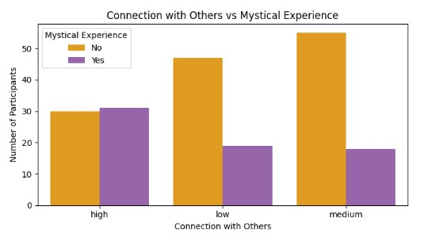

# Predicting Mystical Experiences (ME) at Raves, using neural networks

This project explores how psychological, contextual, and emotional factors might influence the likelihood of having a **mystical experience** during a rave or electronic music event. A mystical experience is a subjective experience characterized by a sense of union with something greater than oneself, often described as a profound spiritual or transcendent encounter.
Here I combine simulated data, data visualization, and a neural network model built in Keras.

---

## Context

Based on a fictional but psychologically grounded dataset of 200 individuals attending raves, each described by:

- Age
- Gender
- Emotional state before the event
- Substance use (yes/no)
- Music type (e.g., techno, trance, ambient)
- Spirituality level (self-reported measure)
- Visual and sensory intensity of the event
- Social connection during the experience

The target variable was whether the person had a **mystical experience** (`1 = yes`, `0 = no`).

---

## Data simulation

The dataset was synthetically created based on probabilities informed by real psychological insights (e.g., emotional state, social connection, spirituality).

Example:

| age | emotion   | spirituality | visuals | connection | mystical |
|-----|-----------|--------------|---------|------------|----------|
| 27  | euphoric  | high         | high    | high       | 1        |
| 31  | numb      | low          | low     | low        | 0        |

---

## 📊 Exploratory Data Analysis (EDA)
1. Mystical experience frequency

Out of 200 participants, approximately 70 reported having had a mystical experience. 


2. Emotional state vs Mystical experience

Participants who described their emotional state as *euphoric* were the most likely to report a mystical experience, while those feeling *numb* or *sad* had the lowest frequency.


3. Spirituality level vs Mystical experience

Interestingly, those with a high level of spirituality had nearly equal proportions of “Yes” and “No” responses, indicating that spirituality may be related to—but not fully predictive of—mystical experiences.


4. Substance use vs Mystical experience

Among participants who reported no substance use, very few experienced mystical states. On the other hand, those who did use substances were almost equally split between having and not having mystical experiences. This supports the hypothesis that substance use might increase the likelihood of a mystical experience, but is not a guarantee.


5. Connection with Others vs Mystical experience

Participants who felt more connected with others during their experience were more likely to report a mystical state. This variable appears as one of the strongest correlates with mysticism, hinting at the importance of interpersonal or collective experience in transcendence.



## 🧠 Neural Network Model

The model was built using Keras and consisted of two hidden layers:

python
model = Sequential([
  Dense(16, activation='relu', input_shape=(n_features,)),
  Dense(8, activation='relu'),
  Dense(1, activation='sigmoid')
])

After training the neural network for 50 epochs, the model reached a **test accuracy of 68%**. The training process showed a steady improvement in accuracy, suggesting that the model was learning meaningful patterns from the data.

To further evaluate performance, we generated a **confusion matrix** and a **classification report**:


The model performed well at identifying participants who did **not** report a mystical experience (`True Negatives: 25`), but struggled with correctly identifying those who **did** (`True Positives: 2`). This resulted in a low recall for the "Yes" class (0.17), meaning the model missed many of those with a positive experience.

### 📋 Classification Report Summary

| Class | Precision | Recall | F1-score | Support |
|-------|-----------|--------|----------|---------|
| No    | 0.71      | 0.89   | 0.79     | 28      |
| Yes   | 0.40      | 0.17   | 0.24     | 12      |

Despite its limitations, the model serves as a strong starting point for analyzing subjective and emotional phenomena using artificial intelligence. With more data, better class balance, and fine-tuning, performance on the “Yes” class could be significantly improved.

*The target was binary: whether the participant had a mystical experience (Yes/No).*

### Conclusion
This project demonstrates the feasibility of using neural networks to explore complex psychological phenomena. While based on synthetic data, the approach highlights how affective, social, and contextual variables might interact in meaningful ways. This study sets the foundation for future research using real-world data, more advanced models, and deeper behavioral analysis.

While the neural network's performance leaves room for improvement—especially in predicting rare events—this experiment demonstrates the potential of combining psychology and AI to explore deeply human experiences. This lays the groundwork for future studies using real-world data and more complex models.

### - Tech Stack -
- Python
- Pandas & NumPy
- Seaborn & Matplotlib
- TensorFlow / Keras
- Scikit-learn
- Jupyter Notebook
### - How to Run - 
```bash
pip install -r requirements.txt
jupyter notebook
